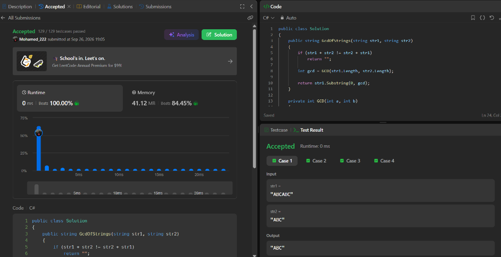

# LeetCode Problem Solutions & Evidence

* **LeetCode Profile:** [Mohamed_222](https://leetcode.com/u/Mohamed_222/)

---

## 1. Valid Anagram
* **Problem URL:** [Valid Anagram](https://leetcode.com/problems/valid-anagram/)
* **Submission Link:** [Accepted Submission #2154131319](https://leetcode.com/problems/valid-anagram/submissions/2154131319/)

### Evidence

### Conceptual Breakdown & Complexity Analysis
* **Anagram Mechanics & Character Frequency Comparison:**
  An anagram is formed when two strings contain the exact same characters with identical frequencies. The algorithm counts character occurrences using a fixed-size integer array of size 26 (representing lowercase English letters `'a'` to `'z'`). As it iterates through string `s`, it increments the count for each character, and as it iterates through string `t`, it decrements the count.
* **Different-Length Handling:**
  If `s.Length != t.Length`, the strings cannot be anagrams. The algorithm performs an early exit check ($O(1)$) returning `false` immediately, avoiding unnecessary computation.
* **Time Complexity:** $\mathcal{O}(N)$
  Where $N$ is the length of the input strings. The algorithm traverses the strings in a single pass of length $N$ followed by a constant-size loop of 26 iterations.
* **Space Complexity:** $\mathcal{O}(1)$
  The frequency array size is fixed at 26 regardless of input size, requiring constant auxiliary space.

---

## 2. Greatest Common Divisor of Strings
* **Problem URL:** [Greatest Common Divisor of Strings](https://leetcode.com/problems/greatest-common-divisor-of-strings/)
* **Submission Link:** [Accepted Submission #2154128518](https://leetcode.com/problems/greatest-common-divisor-of-strings/submissions/2154128518/)

### Evidence

### Conceptual Breakdown & Complexity Analysis
* **String Divisibility & Repeated Patterns:**
  A string `x` divides string `str` if `str` can be constructed by concatenating `x` one or more times. If a common divisor exists for two strings `str1` and `str2`, concatenating `str1 + str2` must equal `str2 + str1`.
* **Why Some Strings Have No Common Divisor:**
  If `str1 + str2 != str2 + str1`, the character ordering or periodic structure of the two strings differs (e.g., `"LEET"` and `"CODE"`). In this case, no common repeating pattern exists, and the function returns `""`.
* **Finding the Greatest Valid Pattern:**
  When `str1 + str2 == str2 + str1` holds true, the length of the greatest common divisor string equals the mathematical Greatest Common Divisor (GCD) of `str1.Length` and `str2.Length`. The largest repeating substring is obtained via `str1.Substring(0, GCD(str1.Length, str2.Length))`.
* **Time Complexity:** $\mathcal{O}(N + M)$
  Where $N$ and $M$ are the lengths of `str1` and `str2`. String concatenation check takes $\mathcal{O}(N + M)$ and Euclidean GCD calculation takes logarithmic time $\mathcal{O}(\log(\min(N, M)))$.
* **Space Complexity:** $\mathcal{O}(N + M)$
  Allocations needed for concatenated string comparisons `str1 + str2` and `str2 + str1` and the final substring output.